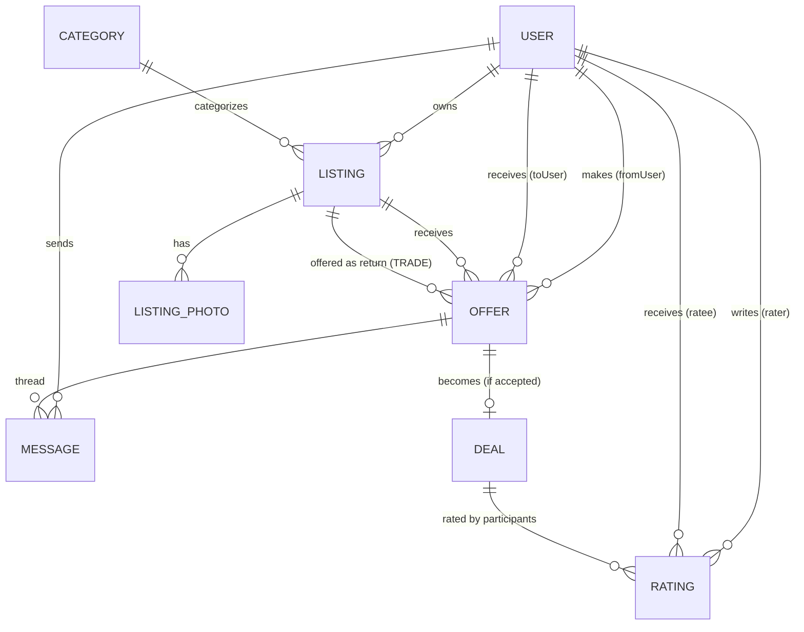

# Domain & Data Model

## 1. Entities

### User
The account holder.

| Attribute | Type | Notes |
|---|---|---|
| id | UUID | PK |
| email | string | unique, lowercased |
| passwordHash | string | bcrypt/argon2 |
| handle | string | unique, public, 3–30 chars, alphanumeric + underscore |
| bio | text | optional, max 500 chars |
| zipCode | string | 5-digit US ZIP; v1 must be `98382` (Sequim) |
| confirmedAdult | boolean | must be true to register |
| createdAt | timestamp | |
| updatedAt | timestamp | |

### Category
Fixed preset list of listing categories, admin-managed.

| Attribute | Type | Notes |
|---|---|---|
| id | UUID | PK |
| name | string | unique, e.g., "Lawn Care," "Fresh Eggs" |
| slug | string | unique, URL-safe |
| active | boolean | soft-disable without deleting |

### Listing
Something a user is offering.

| Attribute | Type | Notes |
|---|---|---|
| id | UUID | PK |
| ownerId | UUID | FK → User |
| categoryId | UUID | FK → Category |
| title | string | 5–100 chars |
| description | text | max 2000 chars |
| offerType | enum | `TRADE_ONLY`, `GIFT_ONLY`, `EITHER` |
| status | enum | `ACTIVE`, `PAUSED`, `DELETED` (soft delete) |
| createdAt | timestamp | |
| updatedAt | timestamp | |

### ListingPhoto
Up to 2 per listing.

| Attribute | Type | Notes |
|---|---|---|
| id | UUID | PK |
| listingId | UUID | FK → Listing |
| url | string | storage location |
| position | int | 0 or 1, enforces ordering |

### Offer
An offer made on a listing. Becomes a Deal if accepted.

| Attribute | Type | Notes |
|---|---|---|
| id | UUID | PK |
| listingId | UUID | FK → Listing (the listing being offered on) |
| fromUserId | UUID | FK → User (offerer) |
| toUserId | UUID | FK → User (lister, denormalized for query speed) |
| offerType | enum | `TRADE`, `GIFT_REQUEST` |
| offeredListingId | UUID? | FK → Listing; required if offerType=TRADE, null if GIFT_REQUEST |
| message | text | optional, max 1000 chars |
| status | enum | `PENDING`, `ACCEPTED`, `DECLINED`, `WITHDRAWN` |
| createdAt | timestamp | |
| respondedAt | timestamp? | |

### Deal
Created when an Offer is accepted. Source of truth for the exchange.

| Attribute | Type | Notes |
|---|---|---|
| id | UUID | PK |
| offerId | UUID | FK → Offer (1:1) |
| dealType | enum | `TRADE`, `GIFT` |
| participantAId | UUID | FK → User (lister) |
| participantBId | UUID | FK → User (offerer) |
| listingAId | UUID | FK → Listing (lister's listing) |
| listingBId | UUID? | FK → Listing (offerer's listing); null for gifts |
| status | enum | `ACCEPTED`, `COMPLETED_BY_A`, `COMPLETED_BY_B`, `COMPLETED`, `CANCELLED` |
| acceptedAt | timestamp | |
| completedAt | timestamp? | |
| cancelledAt | timestamp? | |
| cancelledByUserId | UUID? | |

### Message
In-app chat tied to an Offer (and its resulting Deal).

| Attribute | Type | Notes |
|---|---|---|
| id | UUID | PK |
| offerId | UUID | FK → Offer (messages live on the offer/deal thread) |
| senderId | UUID | FK → User |
| body | text | max 2000 chars |
| createdAt | timestamp | |
| readAt | timestamp? | |

### Rating
One per (deal, rater) pair. Both participants rate each other.

| Attribute | Type | Notes |
|---|---|---|
| id | UUID | PK |
| dealId | UUID | FK → Deal |
| raterId | UUID | FK → User |
| rateeId | UUID | FK → User |
| stars | int | 1–5 |
| review | text | optional, max 1000 chars |
| createdAt | timestamp | |

## 2. Relationships

- **User 1—N Listing** (a user owns many listings)
- **Category 1—N Listing**
- **Listing 1—N ListingPhoto** (max 2)
- **Listing 1—N Offer** (a listing receives many offers)
- **User 1—N Offer** (as `fromUser`; also as `toUser`)
- **Offer 1—1 Deal** (a Deal exists only if Offer was accepted)
- **Offer 1—N Message** (chat thread per offer/deal)
- **Deal 1—N Rating** (exactly 2 per completed deal — one from each participant)
- **User 1—N Rating** (as rater; also as ratee — aggregate to compute profile rating)

## 3. ER Diagram (Mermaid)



## 4. Invariants & Validation Rules

### User
- `email` unique, lowercased, valid format
- `handle` unique, regex `^[a-zA-Z0-9_]{3,30}$`
- `confirmedAdult` must be true at registration
- `zipCode` must be `98382` in v1 (single-ZIP allowlist; expand later if Sequim coverage requires it)
- Cannot hard-delete a User who has active Deals (soft-delete or block until deals close)

### Listing
- `ownerId` must reference a non-deleted User
- `categoryId` must reference an `active` Category
- A `DELETED` listing cannot receive new Offers
- Soft-delete only: deleting a listing must not break historical Deals/Offers that reference it
- **Edits are allowed while pending offers exist; pending offers remain valid (no snapshotting in v1)**

### ListingPhoto
- Max 2 per listing (enforced in app + DB unique index on `(listingId, position)`)
- `position` ∈ {0, 1}

### Offer
- `fromUserId` ≠ `toUserId` (cannot offer on your own listing)
- `toUserId` must equal `listing.ownerId` (denormalization integrity)
- If `offerType = TRADE`: `offeredListingId` is required AND must be owned by `fromUserId` AND target listing's `offerType` must allow trade (`TRADE_ONLY` or `EITHER`)
- If `offerType = GIFT_REQUEST`: `offeredListingId` must be null AND target listing's `offerType` must allow gift (`GIFT_ONLY` or `EITHER`)
- Only one `PENDING` Offer per (fromUser, listing) pair (prevents spam)
- Status transitions: `PENDING` → {`ACCEPTED`, `DECLINED`, `WITHDRAWN`} only
- **Offerer can withdraw a `PENDING` offer at any time before it is accepted or declined**
- **When an Offer is `ACCEPTED`, all other `PENDING` Offers on the same listing are auto-declined** (status → `DECLINED`)

### Deal
- Exactly one Deal per accepted Offer
- `participantA` = offer.toUser (lister), `participantB` = offer.fromUser (offerer)
- `dealType = GIFT` ⇒ `listingBId` is null
- `dealType = TRADE` ⇒ `listingBId` is required
- A user cannot have a Deal with themselves
- **Either party may cancel an `ACCEPTED` or partially-completed deal unilaterally**
- Status transitions:
  - `ACCEPTED` → `COMPLETED_BY_A` (A marks done) or `COMPLETED_BY_B` (B marks done)
  - `COMPLETED_BY_A` + B marks done → `COMPLETED`
  - `COMPLETED_BY_B` + A marks done → `COMPLETED`
  - `ACCEPTED` or `COMPLETED_BY_*` → `CANCELLED` (either party)
  - On transition to `COMPLETED`, both participants are prompted (in-app) to rate each other
  - Once `COMPLETED` or `CANCELLED`, terminal — no transitions out

### Message
- `senderId` must be one of the Offer's two participants (fromUser or toUser)
- Cannot post messages on Offers in `WITHDRAWN` or `DECLINED` status
- Cannot post on Deals in `CANCELLED` or `COMPLETED` status (archive-only view)

### Rating
- Only allowed when Deal status is `COMPLETED`
- `raterId` must be one of the Deal's two participants
- `rateeId` must be the *other* participant
- Unique constraint on `(dealId, raterId)` — one rating per rater per deal
- `stars` ∈ [1, 5]
- Ratings are immutable once submitted (v1; revisit if abuse appears)
- **Gift-only listings receiving trade offers are rejected at the Offer level (offerType must match listing's allowed offerType)**

## 5. State Machines

### Offer
```
[PENDING] ──accept──▶ [ACCEPTED] ──(creates Deal; auto-declines siblings)──▶ end
   │
   ├──decline────▶ [DECLINED]   (terminal)
   └──withdraw───▶ [WITHDRAWN]  (terminal; only fromUser can withdraw)
```

### Deal
```
[ACCEPTED]
   │
   ├── A marks complete ──▶ [COMPLETED_BY_A] ──B marks complete──▶ [COMPLETED]
   │                              │
   │                              └── either party cancels ──▶ [CANCELLED]
   │
   ├── B marks complete ──▶ [COMPLETED_BY_B] ──A marks complete──▶ [COMPLETED]
   │                              │
   │                              └── either party cancels ──▶ [CANCELLED]
   │
   └── either party cancels ──▶ [CANCELLED]
```

`COMPLETED` and `CANCELLED` are terminal. On entering `COMPLETED`, both participants are prompted in-app to rate each other.

### Listing
```
[ACTIVE] ⇄ [PAUSED]   (owner can pause/unpause)
   │
   └──delete──▶ [DELETED]   (soft; preserves historical Deals)
```

## 6. Resolved Decisions

1. **Two-sided completion**: both parties must mark the deal as done; on the second mark, deal moves to `COMPLETED` and both are prompted to rate.
2. **Cancellation**: either party can cancel unilaterally before the deal is fully completed.
3. **Withdrawing an offer**: offerer can withdraw a `PENDING` offer at any time.
4. **Multiple offers on one listing**: when one is accepted, all other pending offers are auto-declined.
5. **Editing a listing with pending offers**: edits are allowed; pending offers remain valid (no snapshotting in v1).
6. **Gift-only listings receiving trade offers**: rejected at the Offer validation layer.
7. **ZIP code scope**: v1 allows only `98382`. Expand the allowlist later if needed.
